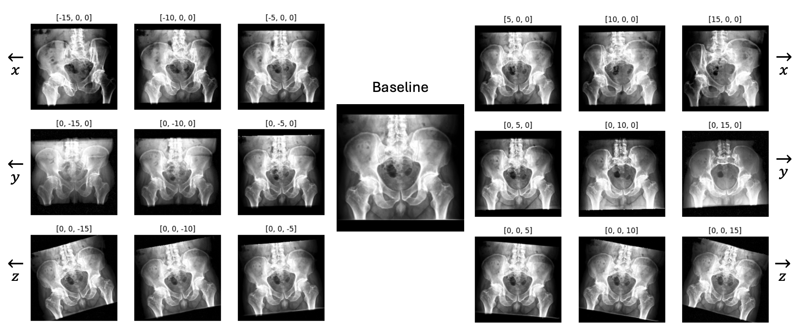

# RadRotator: 3D Rotation of Radiographs with Diffusion Models

This repository contains the GitHub repository for the [RadRotator blog page](https://pouriarouzrokh.github.io/RadRotator).

You can also visit our [demo page](https://huggingface.co/spaces/Pouriarouzrokh/RadRotator) on Hugging Face Spaces, or check our paper on arXiv:

